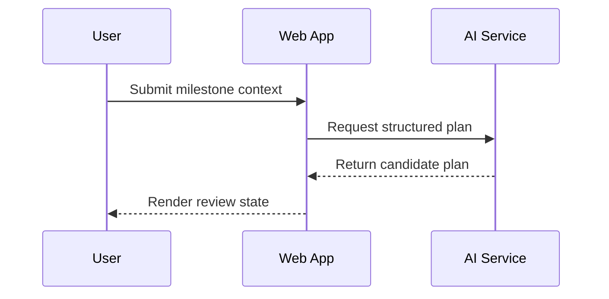
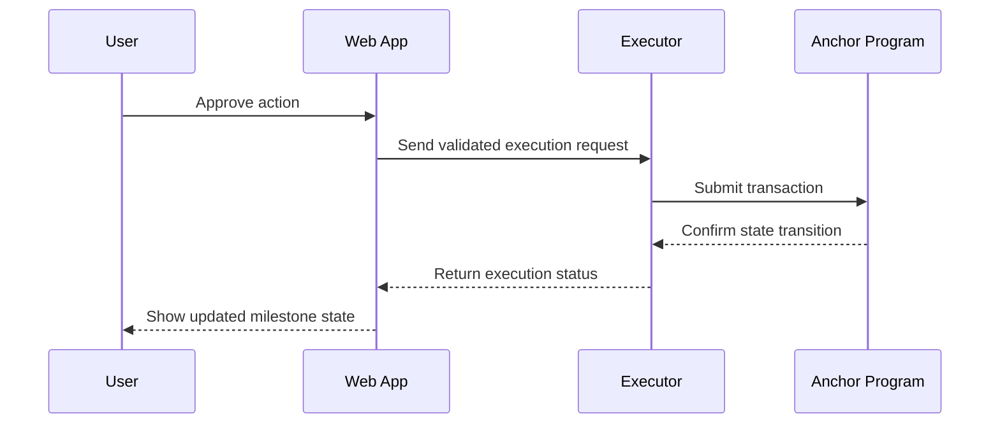

# MilestoneMind Architecture

## Components

- `apps/web`: future UI shell for wallet connection, milestone review, and operator visibility.
- `services/ai`: off-chain reasoning boundary that can transform product inputs into executable plans.
- `services/executor`: off-chain execution boundary that receives validated intents and performs relayer-style actions.
- `programs/milestone_mind`: on-chain authority and state transition boundary for verifiable milestone state.
- `packages/shared`: shared TypeScript contract surface for service-to-service types.

## Boundaries

- The Anchor program owns deterministic state, permissions, and settlement-critical transitions.
- The AI service never mutates on-chain state directly; it only prepares off-chain decisions and artifacts.
- The executor never invents product rules; it executes validated instructions and mediates external side effects.
- The web app stays thin and delegates heavy computation and execution to services.

## Data flow

1. A user enters the system through the web client.
2. The web client calls the AI service for plan generation or structured reasoning.
3. The AI service returns structured output that the web app or backend orchestration can review.
4. Approved work is handed to the executor service.
5. The executor service signs, relays, or coordinates with the Anchor program.
6. On-chain state becomes the source of truth for milestone progression.

## On-chain / off-chain split

### On-chain

- milestone state
- access control
- canonical lifecycle transitions
- auditable settlement-critical actions

### Off-chain

- user interfaces
- AI inference and prompt orchestration
- retries, scheduling, and relaying
- integrations with non-Solana systems

## Sequence diagrams

### Planning request

### Approved execution

